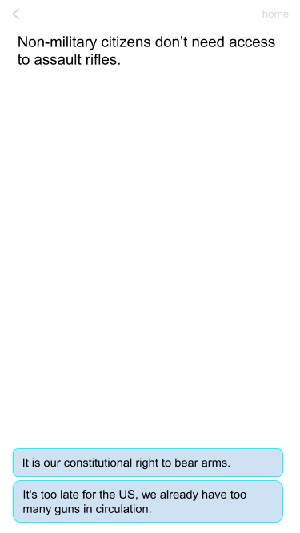

## Political debate app (master)

This repo is the master for all our code repos. It has a [kanban board](https://github.com/samyachour/PoliticalDebateApp_Backend/projects/1?fullscreen=true) for task management and also indexes all our debate map documents.

### The app

The political debate app concept is simple: explore the pro & con sides of contentious issues via an interactive (bandersnatch-esque) interface.

#### Design

Each frontend homepage opens with a search bar, a grid of all our issues, and a login button in the top right (opens a modal with email & password, to register just adds a second confirm password field) ('log in' becomes a gear after login and leads to a settings page with log out, delete acct, and password/email change options).

Each point is accompanied by several responses (rebuttals). Some of these lead to separate points some lead deeper into this given point. At the end of a map the user just sees a darker 'complete button.'

#### Debate maps

The app's backend content can be modified by creating stylized text files called [debate maps](Debate_maps/Template) (usually with no extension).

The backend has a script that can parse these documents and create a new debate page based on it, with the frontends then pulling this on start.

#### Misc

- We aggregate commits onto develop and merge onto master weekly incrementing version by release e.g. 'x.1' > 'x.2'
    - branches off develop must be associated with an existing issue and follow the naming convention 'issue[#]/[type]/[name]' for example 'issue7/enhancement/BasicDjangoRestSetup'
        - if necessary, we can create (& merge) hotfix branches off of master
    - submit pull requests to develop & attach a reviewer & associated issue (to automate kanban board task management)
- We use [Test-driven-development](https://en.wikipedia.org/wiki/Test-driven_development) to ensure minimal code debt.
- The intended user base is anyone who wants to solidify their arguments for a certain issue or explore the other side's perspective.

## Political debate app (backend)

This repo is the backend for each of the 3 frontend repos ([web](https://github.com/samyachour/PoliticalDebateApp_Web), [iOS](https://github.com/samyachour/PoliticalDebateApp_iOS), and [Android](https://github.com/samyachour/PoliticalDebateApp_Android)). It has a [kanban board](https://github.com/samyachour/PoliticalDebateApp_Backend/projects/1?fullscreen=true) for task management that is automatically managed by issues & pull requests.

### Framework

For our backend we use the [Django Rest Framework](https://www.django-rest-framework.org) with [PostgreSQL](https://www.postgresql.org).

#### Usage

- Useful commands:
    - on start: `source venv/bin/activate` `pg_ctl -D /usr/local/var/postgres start` (or `stop`)
    - `python manage.py makemigrations` `python manage.py migrate` `python manage.py test` `python manage.py runserver` `psql -d PoliticalDebateApp -U politicaldebateappowner`

#### Setup

Dependencies:
- Python 3.x (manual)
- Django 2.x
- Django rest framework 3.x
- Django rest framework JWT 1.x
- PostgreSQL 11.x (manual)
- Psycopg2 2.x

Instructions:
- install latest python with homebrew `brew install python` or `brew upgrade python`
- install latest postegresql with homebrew `brew install postgresql`
- run build_venv.sh `./build_venv.sh` to install and run your venv (needing python3.7 as well as django + djangorestframework)
- create a secrets.py file in PoliticalDebateApp/ with the variables `secretKeyHidden` (Django key) & `secretPostgreUser` and `secretPostgrePassword` (PostgreSQL credentials)

### Endpoints

- our current API version is v1, so all endpoints start with 'http://127.0.0.1:8000/api/v1'

###Architecture

- Here is out current setup:
    - User (default Django User model)
        -username: String
        -email: String
        -password: String
    - Token
    - Debate
        -title: String (foreign key)
        -subtitle: String
        -date updated: Date
        -debate_map: JSON [String: Array[String]]
    -Progress
        -userID: String (automatic)
        -debate_title: String (Debate.title)
        -seen_points: Array[String (Debate.debate_map[point])]
    -ReadingList
        -userID: String (automatic)
        -reading_list: Array[String (Debate.title)]
